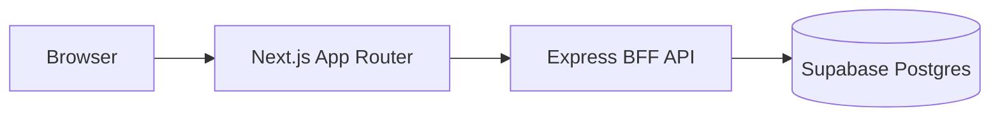

# ReelingIt

A movie (and optional TV) discovery experience with a dark, cinematic UI designed for fast browsing, instant search, and rich title detail pages.

> ReelingIt is **read-heavy**: most screens are browse / list / detail. v1 has no accounts, ratings, or social features.

## Documentation

- [`spec-reelingit.md`](./spec-reelingit.md) — product spec (goals, users, UX principles, scope)
- [`tech-spec-reelingit.md`](./tech-spec-reelingit.md) — technical spec (architecture, API, schema, performance budget)
- [`docs/`](./docs) — operational guides (database CLI, etc.)
- Linear project: [ReelingIt](https://linear.app/pk-hq/project/reelingit-vercel-85344fa77a04/overview)

## Tech stack

| Layer         | Choice                                        |
| ------------- | --------------------------------------------- |
| Front end     | Next.js (App Router), Tailwind CSS, shadcn/ui |
| Middle tier   | Node.js + Express (BFF-style API)             |
| Back end      | Supabase Postgres + Drizzle ORM + drizzle-kit |
| CI/CD         | GitHub Actions                                |
| Observability | PostHog + structured logs / metrics           |

## Architecture



- `apps/web` calls the API via `NEXT_PUBLIC_API_URL`.
- `apps/api` is the only service that holds `DATABASE_URL` and runs Drizzle queries/migrations.

## Repo layout

```text
reelingit/
  apps/
    api/          # Express + Drizzle (reads DATABASE_URL)
    web/          # Next.js + Tailwind + shadcn
  docs/           # operational guides
  spec-reelingit.md
  tech-spec-reelingit.md
  README.md
```

> The `apps/` workspaces are scaffolded as pnpm workspace stubs. See the Linear milestones below for remaining work per app.

## Getting started

Prerequisites: Node `>=20` (see [`.nvmrc`](./.nvmrc)) and pnpm `>=9`.

```bash
pnpm install
```

Copy env files (template in `.env.example` once PK-123 lands):

- `apps/api/.env` — `DATABASE_URL`, `PORT` (e.g. `4002`), `CORS_ORIGIN` (e.g. `http://localhost:3000`)
- `apps/web/.env` — `NEXT_PUBLIC_API_URL` (e.g. `http://localhost:4002`)

Workspace scripts (root):

```bash
pnpm dev        # run all apps in parallel
pnpm build      # build all apps
pnpm typecheck  # tsc --noEmit across workspaces
pnpm lint       # lint across workspaces
pnpm test       # test across workspaces
```

All root scripts use `pnpm -r --if-present`, so a workspace missing a given script is skipped, not failed.

See [`docs/database-cli-guide-reelingit.md`](./docs/database-cli-guide-reelingit.md) for database and migration workflows.

## API (read-only, v1)

Responses are shaped for the UI to avoid leaking raw DB structure.

- `GET /v1/rows/:rowId?cursor=&limit=` — browse row / collection
- `GET /v1/search?q=&type=title|person&cursor=` — search
- `GET /v1/titles/:id` — title detail (credits, keywords, related)
- `GET /v1/people/:id` — person detail _(optional in v1)_
