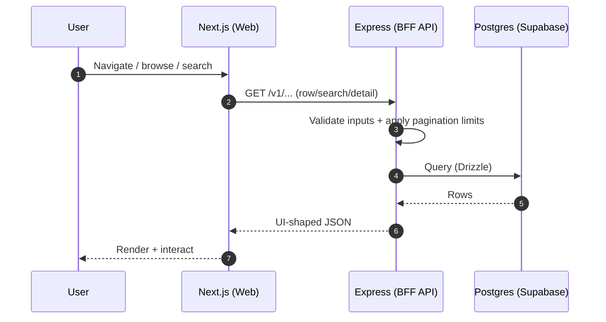
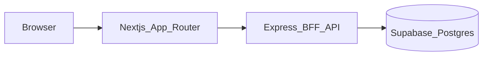
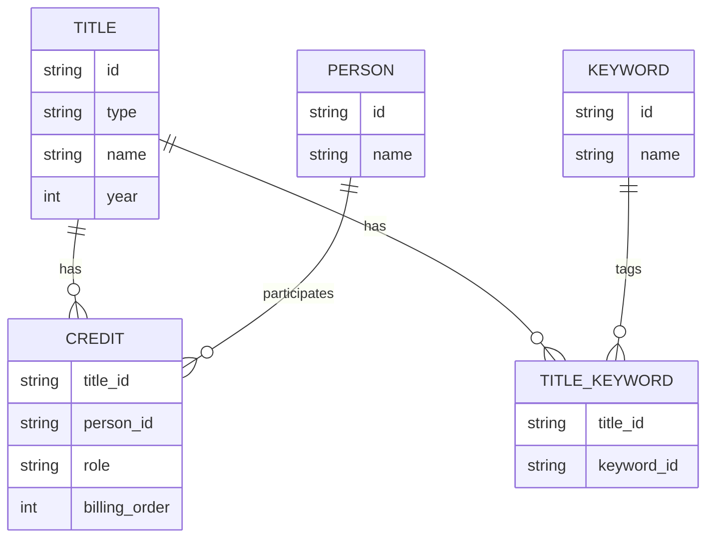

# ReelingIt — technical spec

This doc captures **implementation-level** decisions for ReelingIt. The product overview lives in `spec-reelingit.md`.

## Tech stack (target)


| Layer                     | Choice                                                                          |
| ------------------------- | ------------------------------------------------------------------------------- |
| Front end                 | **Next.js** (App Router), **Tailwind CSS**, **shadcn/ui**                       |
| Middle tier               | **Node.js + Express** (BFF-style API for the web app)                           |
| Back end                  | **Supabase Postgres** + **Drizzle ORM** + **drizzle-kit** (schema + migrations) |
| CI/CD                     | **GitHub Actions** (lint/typecheck/tests; deploy via chosen hosts)              |
| Observability / analytics | **PostHog** + logging/metrics/tracing                                           |


## Layers

---

### Middle tier layer (API / BFF)

Role (1 line): a thin **web-facing API** that centralizes data access, shapes responses for the UI, and hides database details.

- **Tech stack**
  - Node.js + Express
  - Talks to Supabase Postgres via Drizzle (from the backend layer)
- **Data flow (high level)**




- **Responsibilities**
  - Query the catalog DB (read-only v1)
  - Provide stable JSON shapes for rows, search, and detail pages
  - Enforce CORS, input validation, pagination limits, and caching headers where applicable
- **Non-responsibilities (v1)**
  - Auth, user personalization, writes/mutations, admin tooling

---

### Back end layer (database + schema + data access)

#### Architecture




- **Next** calls the API with `NEXT_PUBLIC_API_URL`.
- The API is the only service that uses `DATABASE_URL` and runs **Drizzle** queries/migrations.
- Prefer Supabase **pooler** URI if the API runs as short-lived instances (serverless).

#### API design (read-only v1)

Keep responses shaped for the UI (rows, search, detail) and avoid leaking raw DB structure.

- **Browse rows / collections**
  - `GET /v1/rows/:rowId?cursor=...&limit=...`
  - Response: `{ row: { id, title }, items: TitleCard[], nextCursor }`
- **Search**
  - `GET /v1/search?q=...&type=title|person&cursor=...`
  - Response: `{ q, results: (TitleCard|PersonCard)[], nextCursor }`
- **Title detail**
  - `GET /v1/titles/:id`
  - Response: `{ title, credits, keywords, related }`
- **Person detail (optional v1)**
  - `GET /v1/people/:id`
  - Response: `{ person, knownFor, credits }`

#### Data modeling & schema design (schema discovery → formalize)

If you’re mixing the terms, that’s normal:

- **Data modeling**: deciding *what concepts exist* (Title, Person, Credit, Keyword), what fields they need, and what the relationships mean in the product.
- **Schema design**: mapping that model into *actual Postgres tables, columns, constraints, and indexes* (and how it evolves via migrations).

In practice for this project, we can treat this as **one section** with two subtitles: “conceptual model” and “physical schema”.

ReelingIt is a catalog (movies/TV optional). We’ll formalize entities after seeding + introspection.

- **Conceptual model (entities)**
  - `Title` (movie / tv)
  - `Person` (actor/director/etc.)
  - `Credit` / join table (title ↔ person with role/job/order)
  - `Keyword` or `Tag` (title ↔ keyword)
- **Conceptual relationships**
  - Title ↔ Person is **many-to-many** (via credits)
  - Title ↔ Keyword is **many-to-many**
- **Entity diagram (conceptual)**




- **Physical schema (placeholders)**
  - Constraints: primary keys, foreign keys, uniqueness, not-null
  - Indexes: lookup by id, search fields, join performance (credits/keywords)
  - Migrations: **drizzle-kit** as the source of truth
- **Seeding**
  - Seed via **drizzle-kit** migrations, Supabase SQL editor, or fixtures from a licensed dataset/export.

#### CI/CD pipeline (GitHub Actions)

- **Checks on PR**
  - Install deps
  - Lint / format (project’s chosen tools)
  - Typecheck
  - Unit tests (where present)
  - Optional: build `apps/web` and `apps/api`
- **Deploy**
  - Next and API can deploy independently (hosting choice can evolve)
  - Migrations: run as a controlled step (manual approval or on deploy, depending on risk)

#### Authentication (placeholder)

- Not in scope for v1. When we add it, decide:
  - Provider (e.g. Clerk/Auth0/Supabase Auth) and where sessions live
  - Which API routes require auth and how to enforce it

#### Caching (placeholder)

- Not in scope for v1. When we add it, decide:
  - What to cache (rows/search/detail) and cache keys/TTL
  - Where caching lives (API in-memory, Redis, CDN/edge, Next caching)

#### Environment variables

`**apps/api` (Express)**

- `DATABASE_URL` — Supabase Postgres (pooler recommended for serverless)
- `PORT` — e.g. `4002` locally
- `CORS_ORIGIN` — Next.js origin (e.g. `http://localhost:3000` in dev)

`**apps/web` (Next.js)**

- `NEXT_PUBLIC_API_URL` — API base URL

---

### Front end layer (Next.js)

Role (1 line): the **user-facing web app** that renders browse/search/detail experiences with a strong performance budget.

- **Tech stack**
  - Next.js (App Router)
  - Tailwind CSS + shadcn/ui
- **Frontend / UX**
  - Dark, cinematic layout with carousels/rows, search, and detail pages
  - Strong empty/loading/error states (especially for rows and search)
- **Rendering approach**
  - Default to **Server Components** for layout + initial data hydration
  - Use **Client Components** only where needed (carousel interactions, search input, filters)
  - Prefer **route-level loading** UI and streaming for perceived performance
  - Images: Next `<Image />` with placeholder strategy (blur/solid) and responsive sizes
- **Performance spec (targets / budget)**
  - Target Core Web Vitals (p75, mobile):
    - **LCP** ≤ 2.5s
    - **INP** ≤ 200ms
    - **CLS** ≤ 0.1
  - Page weight budget (initial load, rough targets):
    - Keep critical JS lean; avoid large client bundles for carousels/search
    - Defer non-critical UI and analytics until after first render when possible
  - Practical constraints:
    - Carousels can be expensive; prefer virtualization or limited DOM nodes per row
    - Avoid loading full-resolution images in lists; fetch appropriately sized posters

## Cross-cutting: observability & analytics

This doesn’t belong to only one layer; it spans web + API.

- **Analytics (PostHog)**
  - Frontend events: search performed, title opened, row interacted, errors
  - Keep PII out of events; use coarse identifiers and sampling if needed
- **Monitoring / tracing**
  - API: structured logs, request IDs, latency + error rate metrics
  - Optional: OpenTelemetry tracing (API first; frontend later if valuable)
  - Alerting focus (v1): elevated 5xx rate, slow p95 latency, DB connection errors

## Repo layout (suggested)

```text
reelingit/
  apps/
    api/          # Express + Drizzle + DATABASE_URL
    web/          # Next.js + Tailwind + shadcn
  spec-reelingit.md
  tech-spec-reelingit.md
  README.md
```

